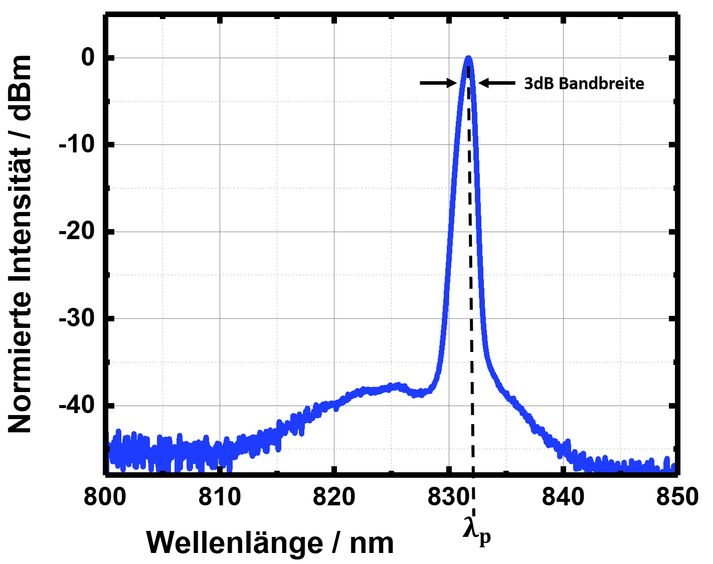

## The Laser Diode Analyzer
This Python-bases analysis tool automates the evaluation of raw measurement data obtained during the investigation of pulsed laser diodes.

**Note**: This code was developed between 2021 and 2023 without AI assistance.

### This Respository

This repository contains two directories. In the directory `small_testdataset`, you will find a typical example of a raw dataset obtained during the electro-optical investigation of a pulsed laser diode.
The dataset contains measurements of an intensity autocorrelation (ACF), the current-voltage-power characteristics of the laserdiode (PUI), the optical spectrum (S), and the radio-frequency spectrum of the laser diode (RF) over different frequency spans.

#### Analyse the data
In the directory `LaserDiodeAnalyzer`, you will find the program for analyzing the test dataset.
To start the analysis, run the script `gui_main.py`. A graphical user interface (GUI) will open, allowing you to select multiple folder containing the raw measurement datasets using the Browse button.
Using the checkboxes , you can select which types of measurement data you want to analyze (PUI, ACF, optische Spektren, Rf Spektren). 
Press the **"Auswertung Starten"** button to start the analysis.

## Discription of what this Program does 

### Backgrund to the experimental measurement
First, we apply a constant voltage to the absorber of the laser Diode. To investigate the electro-optical characteristics of the laser diode, we apply an excitation current to the active region and sweep this current. For each current step, we measure the optical output power, the opptical spectrum, the intensity autocorrelation of the light pulses, and the raidio-frequeny spectrum over different frequency spans.

### The Results
When the analysis is complete, you will find a directory called `Auswertung`inside the directory containing the raw measurement data. Depending on which checkboxes you selected, you will find the corresponding analysis results.

If you run the full analysis with all chckboxes selected, you will get the following results:

1. **The dirctories `ACF`, `Opt`, `PUI` and `RF`** 
    These directories contain the analysis results for the different measurements.

2. **A large number of CSV files** 
    These files contain the most relevant results of the analyses for the different measurements.

In the following sections, I will explain the physical and mathematical background of these results for the different measurements and indicate the correspondinng files in which these results cen be found.

**Note:** The results are obtained from measurement data and not from theoretical simulations. Therefor, this program does not generate graphs of the data. The reason is that the graphs usually need to be individually modified because each diode has its own characteristics. Therefore, a plotting program such as Origin is essential for visualizing the data appropriatley.

### The optical spectrum 
The optical spectrum is measured unsing a spectrum analyzer. The spectrum analyzer measures the light intensity (in dBm) over a specified wavelength range.

The following figure shows a typical normalized optical spectrum of a pulsed laser diode. The characteristic quantities, namely the peak wavelength $\lambda_p$ and the 3 dB bandwidth, are marked.

  

For every measured spectrum (reminder: we sweep the excitation current and measure a spectrum at each current step), the program determines the peak wavelength and the 3 dB bandwidth using the following procedure:

1. **Convert the raw data into a CSV file** 
    First, the program converts the raw data into a CSV file and removes all unnecessary information contained in the raw `.dat` file. This file can be found in the directory `Auswertung/Opt/.../`under the name `opt_cleanRawData`.

    In a second step, the program reshapes the data and creates another CSV file named `opt_x.xxV_PlotDaten`. In Column A, you will find the wavelength. The first row contains the excitation current, and below each excitation current, you will find the measured (unnoralized) intensity at the corresponding wavelength. 

2. **Normalize the spectra to the maximum peak intensity** 
    To normalize the spectra, the program frirst determines the highest peak intensity among all measured spectra. This peak intensity is then substracted from each measured spectrum, resulting in a relative intensity scale referenced to the maximum peak intensity. The normalized spectra are saved in the CSV file `opt_normiert_x.xxV_PlotDaten` in the directory `Auswertung/Opt/.../`. 
    
3. **Estimation of the peak wavelength** 
    To estimate the peak wavelength, the program determines the wavelength corresponding to the highest intensity in each soectrum using the unnormalized data from `opt_x.xxV_PlotDaten`. The peak wavelength for each measured spectrum is then saved in the CSV file `opt_peak_Wellenlaenge` in the directiory `Auswertung/`. 

4. **Estimation of the 3 dB bandwidth** 
    The 3 dB bandwidth is the wavelength range between the two wavelengths at which the intensity has decreased by 3 dB relative to the peak intensity.   
    To estimate the 3 dB bandwidth, the program first divides the spectrum at the peak wavelength into a left and a right part. It then subtracts 3 dB from the peak intensity to determine the target intensity corresponding to the 3 dB level.   
    For both the left and the right part of the spectrum, the program searches for the measured wavelength whose intensity is closest to this target intensity. The two neighboring data points around this wavelength are then used to perform a linear fit. From this fit, the program determines the slope and y-intercept of the line and uses them to estimate the wavelength at which the spectrum exactly reaches the 3 dB level.   
    This procedure is performed independently for the left and the right sides of the spectrum, resulting in two 3 dB wavelengths. The 3 dB bandwidth is then calculated as the difference between these two wavelengths:   
    $$\Delta\lambda_{3,\mathrm{dB}} = \lambda_{3,\mathrm{dB,right}} - \lambda_{3,\mathrm{dB,left}}$$  
    These estimated 3 dB bandwidths of all measured spectra are saved in the CSV file `opt_3dB_Bandbreite`in the directory `Auswertung/`.
    

